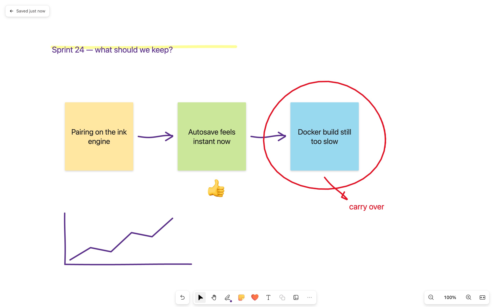
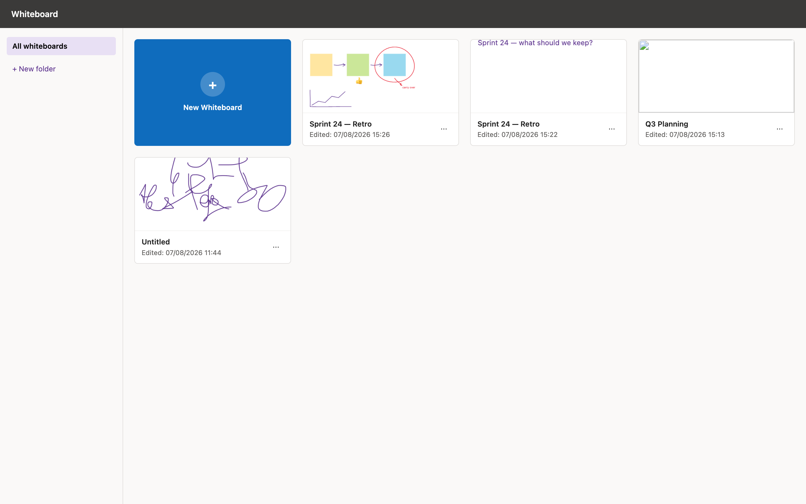

# Whiteboard

A self-hosted infinite whiteboard, closely modelled on Microsoft Whiteboard.
Ink, sticky notes, text and templates, with everything stored on your own
machine.





## Status

**This project is finished and is not being developed further.** It does what
its author needed it to do. Bugs and half-built corners are listed below rather
than hidden.

Pull requests are welcome and will be reviewed — especially ones that finish
the tools marked *not implemented*.

## Run it

```bash
docker compose up -d      # http://localhost:3001
```

All state lives in one directory (`./whiteboard-data` by default): a SQLite
database for board and folder metadata, plus one JSON document and one PNG
thumbnail per board. Back it up by copying that directory. `DATA_DIR` moves it.

There is **no authentication** — this is built for a single user on a trusted
network. Put a reverse proxy in front of it if it needs to be reachable from
anywhere else.

## Tools

| Tool | Key | Notes |
|---|---|---|
| Select | `V` | Click, marquee, move, delete |
| Pan | `H` | Also space-drag, middle-drag, right-drag, wheel |
| Pen | `P` | 4 slots (`1`–`4`), 6 thicknesses, adjustable colour and opacity |
| Highlighter | `4` | The fourth pen slot by default |
| Eraser | `E` | Whole-stroke or point erase |
| Sticky note | `N` | 12 colours |
| Reaction | `R` | 18 emoji |
| Text | `T` | Real DOM text — proper caret, selection and IME |
| Templates | — | 20 layouts across 9 categories |
| Undo / redo | `Ctrl/Cmd+Z`, `Ctrl/Cmd+Shift+Z` | 200 steps |

Plus an infinite canvas (zoom 2%–6400%), a dashboard with folders, and autosave
that writes 1.5s after you stop editing.

### Not implemented

These are visible in the interface but **disabled**, so the layout stays true to
Microsoft Whiteboard and the gaps are obvious:

- Lasso select
- Shapes
- The "More" overflow menu
- Sticky-note grids (single notes work)
- Arrow tips on pen strokes

### Known rough edges

- Template labels can clip when a heading is wider than its box.
- A board that has never been saved shows a broken-image icon on the dashboard
  instead of a placeholder.
- Ink always renders beneath sticky notes and text, which are DOM elements.

## Development

```bash
npm install
npm run dev        # Vite on :5173, API on :3001
npm run typecheck
```

`npm run build && npm start` serves the built frontend and the API together on
one port. Note that the server prefers `dist/` whenever it exists — a stale
build looks like your changes are being ignored, so rebuild or delete it.

The frontend is React and plain 2D canvas; the server is Fastify with
better-sqlite3. Ink geometry is built with
[perfect-freehand](https://github.com/steveruizok/perfect-freehand).

Earlier revisions of this file recorded detailed measurements taken from the
real Microsoft Whiteboard — ink geometry, thickness steps, blend modes — along
with the reasoning behind the rendering pipeline. That material is still in the
git history.
